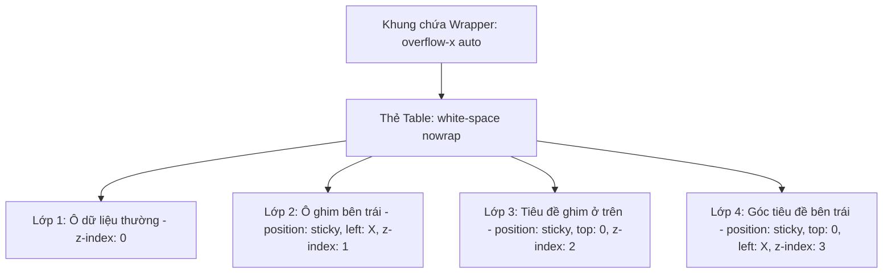

# Hướng Dẫn Kỹ Thuật: Thiết Kế Bảng Cuộn Ngang & Cố Định Cột (Responsive Sticky Table)

Tài liệu này trình bày chi tiết **tư duy thiết kế**, **logic cấu trúc** và **mã nguồn thực thi** giúp giải quyết bài toán: *Ép một bảng dữ liệu có chiều ngang rất lớn (như Bảng phân công công việc, Timesheet, Báo cáo tài chính) vào một khung giao diện nhỏ hơn mà vẫn giữ được khả năng theo dõi thuận tiện.*

---

## 1. Tư Duy Thiết Kế (Mindset & Core Concepts)

Khi thiết kế một bảng rộng nhiều cột (ví dụ 31 ngày trong tháng), nếu thu nhỏ chữ hoặc cố tình co ép các cột, giao diện sẽ bị vỡ và không thể đọc được. 

Tư duy đúng ở đây bao gồm **3 nguyên tắc nền tảng**:

1. **Phân tách trách nhiệm (Separation of Concerns)**:
   * **Khung bọc (Wrapper)**: Đóng vai trò là "cửa sổ nhìn" (Viewport), có kích thước giới hạn cố định theo khung giao diện và chịu trách nhiệm tạo thanh cuộn (`overflow-x: auto`).
   * **Bảng dữ liệu (`<table>`)**: Giữ nguyên kích thước thực tế (có thể rộng 1500px - 3000px) mà không bị thu hẹp hay biến dạng.
2. **Cố định vùng nhận diện (Freeze Identification Columns)**:
   * Khi cuộn sang phải để xem ngày 25, 26, 27..., người dùng sẽ mất mốc dữ liệu nếu không biết hàng đó thuộc về nhân viên nào.
   * Do đó, các cột thông tin gốc (như *STT, Họ tên, Mã nhân viên*) phải được **ghim cố định bên trái (Sticky Left)**.
3. **Phân lớp hiển thị (Z-Index Layering)**:
   * Nội dung trượt phải chui **xuống dưới** các cột ghim bên trái và **xuống dưới** tiêu đề trên cùng (Header).

---

## 2. Logic Cấu Trúc & Phân Lớp (Layering Architecture)

### 2.1 Sơ Đồ Cấu Trúc Phân Lớp



### 2.2 Quy Tắc Tính Vị Trí Ghim (`left` offset)
Các cột ghim bên trái được xếp chồng nối tiếp nhau. Chiều rộng của cột trước chính là vị trí `left` của cột sau:
* **Cột 1 (STT)**: Rộng 60px $\rightarrow$ `left: 0px`
* **Cột 2 (Họ tên)**: Rộng 180px $\rightarrow$ `left: 60px`
* **Cột 3 (Chức vụ)**: Rộng 100px $\rightarrow$ `left: 240px` (bằng 60 + 180)
* **Cột 4 trở đi (Các ngày trong tháng)**: Cuộn tự do bên dưới các cột ghim.

---

## 3. Mã Nguồn Mẫu Chuẩn (Standard Code Template)

Dưới đây là mã nguồn HTML & CSS hoàn chỉnh, độc lập, có thể copy và áp dụng trực tiếp vào bất kỳ dự án nào (React, Vue, HTML/CSS thuần, v.v.).

### 3.1 Cấu Trúc HTML (`index.html`)

```html
<div class="table-wrapper">
  <table class="sticky-table">
    <thead>
      <tr>
        <!-- Các cột được ghim cố định bên trái -->
        <th class="col-sticky col-stt">STT</th>
        <th class="col-sticky col-name">Họ và tên</th>
        <th class="col-sticky col-role">Role</th>
        
        <!-- Các cột dữ liệu cuộn ngang (Ví dụ: 31 ngày) -->
        <th>Ngày 1</th>
        <th>Ngày 2</th>
        <th>Ngày 3</th>
        <!-- ... tiếp tục các ngày ... -->
        <th>Ngày 30</th>
        <th>Ngày 31</th>
      </tr>
    </thead>
    <tbody>
      <tr>
        <td class="col-sticky col-stt">1</td>
        <td class="col-sticky col-name">Nguyễn Văn A</td>
        <td class="col-sticky col-role">Developer</td>
        
        <td>Ca sáng</td>
        <td>Ca chiều</td>
        <td>Nghỉ</td>
        <!-- ... dữ liệu ngày ... -->
        <td>Ca sáng</td>
        <td>Ca sáng</td>
      </tr>
      <tr>
        <td class="col-sticky col-stt">2</td>
        <td class="col-sticky col-name">Trần Thị B</td>
        <td class="col-sticky col-role">Tester</td>
        
        <td>Ca chiều</td>
        <td>Ca chiều</td>
        <td>Ca sáng</td>
        <!-- ... dữ liệu ngày ... -->
        <td>Nghỉ</td>
        <td>Ca sáng</td>
      </tr>
    </tbody>
  </table>
</div>
```

### 3.2 Bộ Mã CSS (`style.css`)

```css
/* ==========================================================================
   1. KHUNG CHỨA (WRAPPER)
   ========================================================================== */
.table-wrapper {
  width: 100%;
  max-width: 100%;
  max-height: 500px; /* Giới hạn chiều cao nếu muốn cuộn dọc */
  overflow: auto;    /* Tự động xuất hiện thanh cuộn ngang & dọc khi tràn */
  border: 1px solid #e2e8f0;
  border-radius: 8px;
  box-shadow: 0 4px 6px -1px rgba(0, 0, 0, 0.1);
  background-color: #ffffff;
}

/* ==========================================================================
   2. BẢNG DỮ LIỆU CHÍNH
   ========================================================================== */
.sticky-table {
  width: 100%;
  border-collapse: separate; /* Bắt buộc dùng separate để border không bị dính lỗi khi scroll sticky */
  border-spacing: 0;
  white-space: nowrap;       /* Giữ các ô không bị tự động ngắt dòng */
  font-family: system-ui, -apple-system, sans-serif;
  font-size: 14px;
}

.sticky-table th,
.sticky-table td {
  padding: 12px 16px;
  border-bottom: 1px solid #e2e8f0;
  border-right: 1px solid #edf2f7;
  text-align: center;
}

.sticky-table th {
  background-color: #f7fafc;
  color: #2d3748;
  font-weight: 600;
  position: sticky;
  top: 0;              /* Ghim tiêu đề lên trên cùng khi cuộn dọc */
  z-index: 2;          /* Cao hơn các ô dữ liệu thường */
}

/* ==========================================================================
   3. LOGIC CỐ ĐỊNH CỘT (STICKY COLUMNS)
   ========================================================================== */

/* Thuộc tính chung cho tất cả các ô được ghim */
.col-sticky {
  position: sticky !important;
  background-color: #ffffff; /* ĐẶC BIỆT QUAN TRỌNG: Phải có màu nền che nội dung bên dưới */
}

/* Cột 1: STT (Rộng 60px) */
.col-stt {
  left: 0px;
  min-width: 60px;
  max-width: 60px;
}

/* Cột 2: Họ và tên (Nằm sau cột 1 -> left = 60px, Rộng 180px) */
.col-name {
  left: 60px;
  min-width: 180px;
  max-width: 180px;
}

/* Cột 3: Role (Nằm sau cột 1 + 2 -> left = 60px + 180px = 240px, Rộng 120px) */
.col-role {
  left: 240px;
  min-width: 120px;
  max-width: 120px;
}

/* Tạo đường bóng đổ nhẹ (Box Shadow) ở cột ghim cuối cùng để phân tách trực quan */
.col-role {
  box-shadow: 4px 0 8px -2px rgba(0, 0, 0, 0.08);
}

/* ==========================================================================
   4. XỬ LÝ Z-INDEX VÙNG GIAO NHAU (HEADER + STICKY COLUMN)
   ========================================================================== */

/* Hàng tiêu đề (th) của các cột ghim cần z-index cao nhất (z-index: 3) */
.sticky-table thead th.col-sticky {
  z-index: 3;
  background-color: #f7fafc; /* Đồng bộ màu nền với Header */
}

/* Tùy chỉnh màu hàng khi Hover */
.sticky-table tbody tr:hover td {
  background-color: #f8fafc;
}
/* Giữ màu nền ô ghim khi Hover trỏ vào hàng */
.sticky-table tbody tr:hover td.col-sticky {
  background-color: #f8fafc;
}
```

---

## 4. Những Lỗi Thường Gặp & Cách Khắc Phục (Pitfalls & Best Practices)

| Lỗi gặp phải | Nguyên nhân | Cách khắc phục |
| :--- | :--- | :--- |
| **Nội dung khi cuộn bị lộ xuyên qua cột ghim** | Quên không đặt `background-color` cho các ô có `position: sticky`. | Thêm `background-color: #fff` (hoặc màu nền tương ứng) vào `.col-sticky`. |
| **Đường viền (Border) bị mất hoặc trượt sai lệch khi cuộn** | Sử dụng `border-collapse: collapse;`. | Đổi sang `border-collapse: separate; border-spacing: 0;`. |
| **Cột ghim đè lên tiêu đề trên cùng khi vừa cuộn dọc vừa cuộn ngang** | Chưa thiết lập thứ tự `z-index` đúng. | Đặt `z-index: 1` cho `td.col-sticky`, `z-index: 2` cho `th` thường, và `z-index: 3` cho `th.col-sticky`. |
| **Cột sticky bị đè vỡ kích thước** | Chưa cố định chiều rộng của các cột ghim. | Luôn đặt `min-width` và `max-width` giống nhau cho các cột sticky để tránh vỡ tính toán `left`. |

---

## 5. Mở Rộng: Tự Động Tính Vị Trí Ghim Bằng JavaScript (Nâng Cao)

Trong trường hợp chiều rộng các cột được thay đổi động hoặc số lượng cột ghim do người dùng cấu hình, việc viết cứng `left: 60px`, `left: 240px` trong CSS sẽ bất tiện. Lúc này ta có thể dùng 1 đoạn JavaScript nhỏ để tự động tính toán:

```javascript
function makeTableSticky(tableSelector, stickyColumnCount) {
  const table = document.querySelector(tableSelector);
  if (!table) return;

  const rows = table.querySelectorAll('tr');

  rows.forEach(row => {
    const cells = row.children;
    let leftOffset = 0;

    for (let i = 0; i < stickyColumnCount; i++) {
      if (!cells[i]) continue;
      
      const cell = cells[i];
      cell.classList.add('col-sticky');
      cell.style.position = 'sticky';
      cell.style.left = `${leftOffset}px`;

      // Cộng dồn chiều rộng của ô hiện tại cho ô tiếp theo
      leftOffset += cell.offsetWidth;
    }
  });
}

// Gọi hàm áp dụng cho bảng với 3 cột đầu tiên được ghim
document.addEventListener('DOMContentLoaded', () => {
  makeTableSticky('.sticky-table', 3);
});
```

---

## 6. Tổng Kết Checklist Cho Dự Án Khác

Khi áp dụng vào bất kỳ dự án nào (React, Angular, Vue, Tailwind CSS, HTML thuần), chỉ cần kiểm tra đủ **4 điều kiện**:

- [x] Có `div` bao bọc với `overflow: auto; width: 100%;`
- [x] Thẻ `table` có `white-space: nowrap;` hoặc chiều rộng cố định lớn hơn khung.
- [x] Ô cột ghim có `position: sticky; left: [vị trí CALCULATED];` và **BẮT BUỘC có `background-color`**.
- [x] Các ô vừa là Header vừa là Sticky Column có `z-index` lớn nhất (`z-index: 3`).
